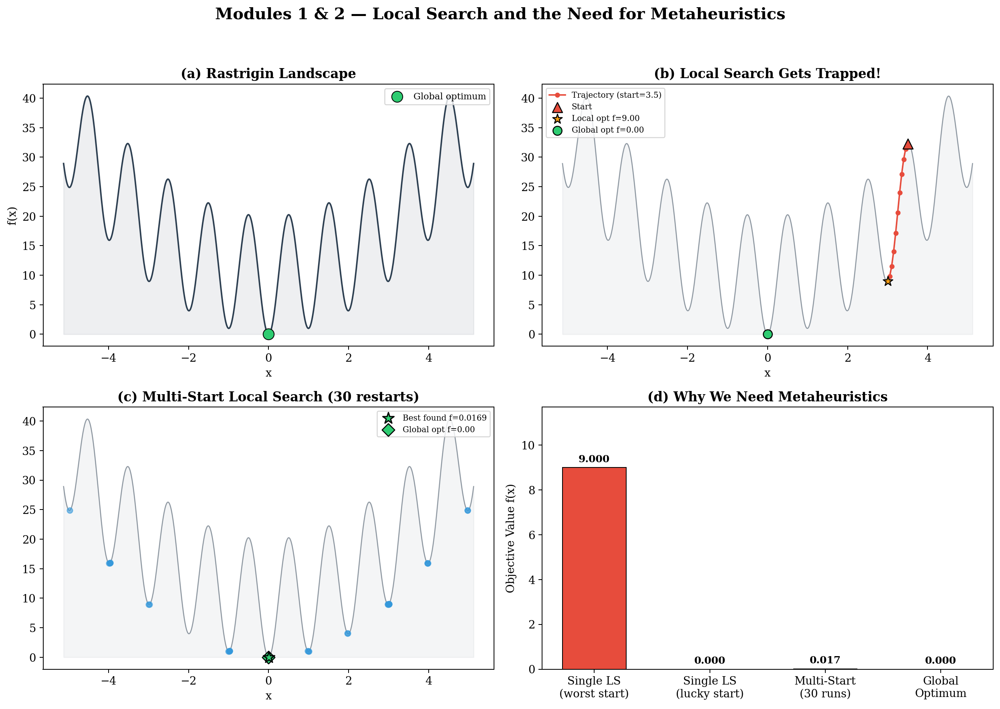
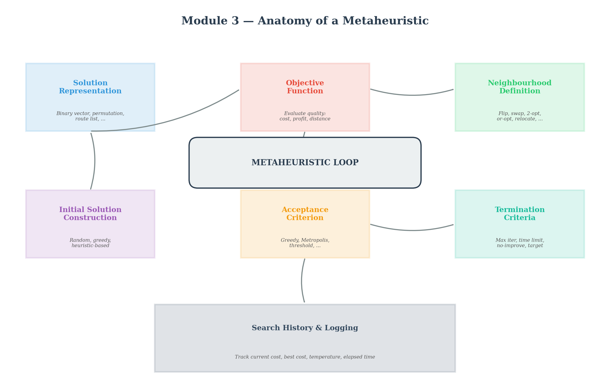
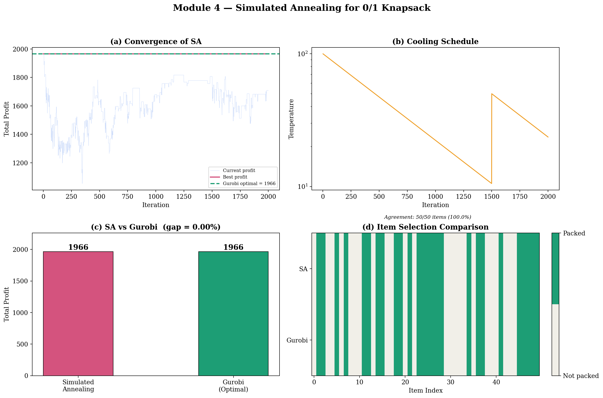
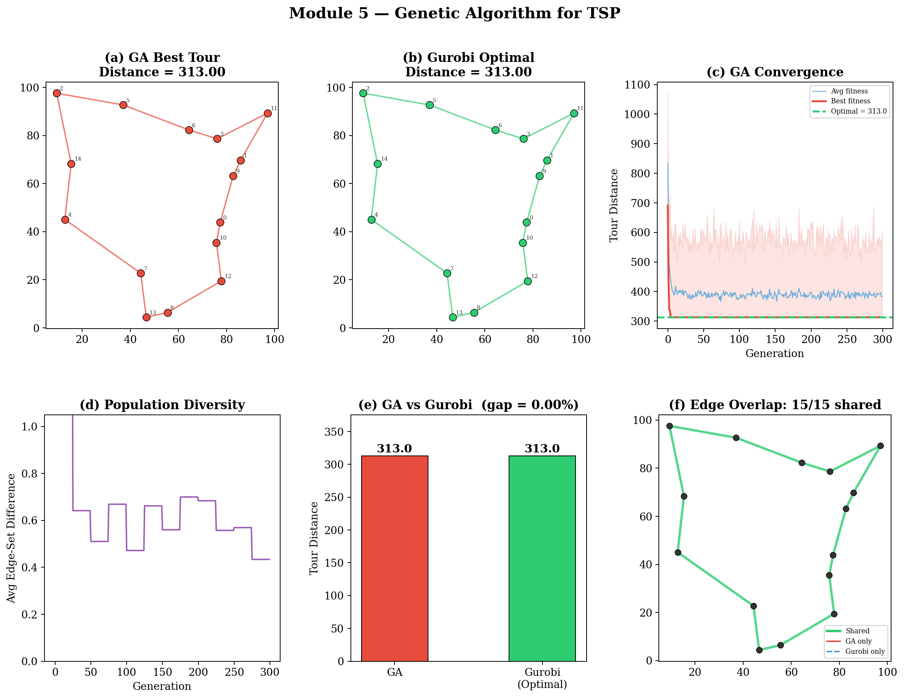
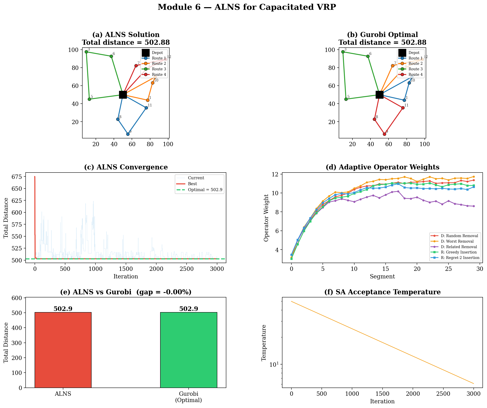

# Metaheuristics

> **A hands-on tutorial with object-oriented implementations and exact-solver benchmarks.**

This repository contains a complete, self-contained tutorial on metaheuristic algorithms for combinatorial optimization.
Every algorithm is implemented from scratch in an object-oriented manner in Python, benchmarked against
exact solutions found by [Gurobi](https://www.gurobi.com/), and accompanied by publication-quality
figures that you can use directly in your slides.

---

## Table of Contents

1. [Quick Start](#quick-start)
2. [Repository Structure](#repository-structure)
3. [Module 1 — What Is Local Search?](#module-1--what-is-local-search)
4. [Module 2 — Why We Need Metaheuristics](#module-2--why-we-need-metaheuristics)
5. [Module 3 — Anatomy of a Metaheuristic](#module-3--anatomy-of-a-metaheuristic)
6. [Module 4 — Simulated Annealing (for Knapsack Problem)](#module-4--simulated-annealing)
7. [Module 5 — Genetic Algorithm (for TSP)](#module-5--genetic-algorithm)
8. [Module 6 — Adaptive Large Neighbourhood Search (for VRP)](#module-6--adaptive-large-neighbourhood-search)
9. [Generating Figures](#generating-figures)
10. [Extending the Framework](#extending-the-framework)

---

## Quick Start

```bash
# 1. Clone the repository
git clone https://github.com/demirayonur/Metaheuristics.git
cd Metaheuristics

# 2. Create a virtual environment (recommended)
python -m venv .venv && source .venv/bin/activate

# 3. Install the package and all dependencies (reads pyproject.toml)
pip install -e .

# 4. Run everything and generate all figures
python -m examples.run_all
```

**Prerequisites:**

| Dependency | Version |
|---|---|
| Python | ≥ 3.10 | 
| NumPy | ≥ 1.24 | 
| Matplotlib | ≥ 3.7 | 
| Gurobi | ≥ 10.0 | 

> **Note on Gurobi:** The restricted licence bundled with `pip install gurobipy`
> is enough to reproduce every result in this tutorial — all Gurobi models here
> stay well under its size limits. Once you push the instances past roughly
> **2,000 variables or 2,000 linear constraints**, the restricted licence will
> refuse to solve the model and you will need either a free academic licence
> or a commercial Gurobi licence.

---

## Repository Structure

```
Metaheuristics/
│
├── src/
│   ├── core/                  #   Abstract building blocks 
│   │   ├── solution.py        #   Solution base class
│   │   ├── objective.py       #   ObjectiveFunction base class
│   │   ├── neighbourhood.py   #   Neighbourhood base class
│   │   ├── acceptance.py      #   Greedy & Metropolis acceptance
│   │   ├── termination.py     #   Composite stopping criteria
│   │   ├── history.py         #   Search trajectory recorder
│   │   └── metaheuristic.py   #   Abstract metaheuristic skeleton
│   │
│   ├── problems/              # Problem definitions
│   │   ├── knapsack.py        #   0/1 Knapsack: data, solution, objective, neighbourhood
│   │   ├── tsp.py             #   TSP: data, solution, objective
│   │   └── vrp.py             #   CVRP: data, solution, objective
│   │
│   ├── algorithms/                  # Metaheuristic implementations
│   │   ├── simulated_annealing.py   # SA with geometric cooling
│   │   ├── genetic_algorithm.py     # GA with OX crossover + 2-opt
│   │   └── alns.py                  # ALNS with 3 destroy + 2 repair operators
│   │
│   ├── solvers/                # Gurobi exact solvers
│   │   ├── gurobi_knapsack.py
│   │   ├── gurobi_tsp.py       # MTZ formulation
│   │   └── gurobi_vrp.py       # Two-index vehicle-flow + MTZ
│   │
│   └── visualization/          # Plotting functions
│       ├── style.py            #   Shared palette & rcParams
│       ├── plot_local_search.py
│       ├── plot_components.py
│       ├── plot_sa.py
│       ├── plot_ga.py
│       └── plot_alns.py
│
├── examples/                  #   Runnable scripts
│   ├── run_all.py             #   Run everything at once
│   ├── run_local_search.py    #   Modules 1 & 2 demo
│   ├── run_sa_knapsack.py     #   Module 4 demo
│   ├── run_ga_tsp.py          #   Module 5 demo
│   └── run_alns_vrp.py        #   Module 6 demo
│
├── docs/figures/              # Generated plots (after running examples)
├── requirements.txt
├── pyproject.toml
├── LICENSE
└── README.md                  # ← You are here
```

---

## Module 1 — What Is Local Search?

### The Idea

Local search is the simplest optimization strategy:

1. **Start** from some initial solution *s*.
2. **Look around** —> examine the *neighbourhood* N(s), the set of solutions reachable in one step.
3. **Move** to the best improving neighbour.
4. **Repeat** until no neighbour is better than the current solution.

When you stop, you are at a **local optimum**, which is a solution that is at least as good as
everything "nearby", but not necessarily the best solution overall.

### Key Vocabulary

| Term | Meaning |
|---|---|
| **Solution representation** | The data structure encoding a candidate answer (binary vector, permutation, route list, …) |
| **Neighbourhood** | The set of solutions reachable from the current one in a single move |
| **Move operator** | The function that transforms one solution into a neighbour (flip a bit, swap two cities, …) |
| **Objective function** | A scalar measure of solution quality —> we minimize throughout this tutorial |
| **Local optimum** | A solution with no improving neighbour —> the search *gets stuck* here |

### Demo

```bash
python -m examples.run_local_search
```

We demonstrate on the 1-D **Rastrigin function**, a classic test landscape with many
local minima.  Starting from x₀ = 3.5, hill-climbing converges to a local minimum at
x = 3.0 with f(x) = 9.0 — far from the global minimum at x = 0, f(x) = 0.



---

## Module 2 — Why We Need Metaheuristics

### The Problem with Greedy

Local search is *greedy*: it only accepts improvements.  On a landscape with many local
optima, this means the search **gets trapped** — the final result depends entirely on
where you start, and most starting points lead to mediocre solutions.

### First Remedy: Multi-Start

The simplest escape strategy is to run local search many times from different random starting points and keep the overall best solution. With 30 restarts on the Rastrigin function, multi start finds $f \approx 0.017$, which is much closer to the global optimum.

### Beyond Multi-Start

Multi start is wasteful because each restart throws away everything the previous search learned. Worse, as problems grow in size and new constraints emerge, as is typical in real world combinatorial optimization, the probability that a random restart lands in a region that leads to a high quality feasible solution drops sharply. For large scale constrained problems, multi start becomes increasingly unlikely to produce competitive results within a reasonable time budget. On the other hand, metaheuristics are smarter. They use various strategies to escape local optima during a single continuous search:

| Strategy | Metaheuristic | How it escapes |
|---|---|---|
| Accept worse moves probabilistically | **Simulated Annealing** | Temperature-controlled random uphill steps |
| Maintain a diverse population | **Genetic Algorithm** | Crossover combines good building blocks |
| Destroy and rebuild parts of the solution | **ALNS** | Large moves jump to distant regions |
| Remember and forbid recent moves | **Tabu Search** | Short-term memory prevents cycling |

---

## Module 3 — Anatomy of a Metaheuristic

### The Shared Skeleton

Despite their differences, nearly all metaheuristics share **six core components**.
Our codebase in `src/core/` implements each one as an abstract base class:



#### 1. Solution Representation (`solution.py`)

How we encode a candidate answer.  This is problem-specific:

```python
# Binary vector for Knapsack
class KnapsackSolution(Solution):
    selection: np.ndarray          # e.g. [1, 0, 1, 1, 0, ...]

# Permutation for TSP
class TSPSolution(Solution):
    tour: list[int]                # e.g. [0, 4, 2, 7, 1, ...]

# List of routes for VRP
class VRPSolution(Solution):
    routes: list[list[int]]        # e.g. [[3, 7], [1, 5, 2]]
```

#### 2. Objective Function (`objective.py`)

Measures solution quality.  **Convention: we always minimize.**
For maximization problems (like Knapsack profit), negate the value.

```python
class KnapsackObjective(ObjectiveFunction):
    def evaluate(self, solution) -> float:
        return -total_value + penalty * max(0, total_weight - capacity)
```

#### 3. Neighbourhood Definition (`neighbourhood.py`)

Defines which solutions are "one step away".  This is the **most important design
decision**. It controls the landscape the search explores.

```python
class KnapsackFlipNeighbourhood(Neighbourhood):
    """Flip one bit — pack or unpack one item."""

    def get_random_neighbour(self, solution, rng):
        neighbour = solution.copy()
        idx = rng.integers(0, self.n_items)
        neighbour.selection[idx] = 1 - neighbour.selection[idx]
        return neighbour
```

#### 4. Initial Solution Construction

Where does the search start?  Options range from purely random to sophisticated greedy
heuristics.  Better starting points usually help, but diversity matters too.

#### 5. Acceptance Criterion (`acceptance.py`)

The critical decision: do we move to the neighbour, or stay put?

```python
class GreedyAcceptance:       # Only improvements — this is local search
    accept = candidate_cost < current_cost

class MetropolisAcceptance:   # SA-style — sometimes accept worse
    accept = (delta < 0) or (random() < exp(-delta / T))
```

#### 6. Termination Criteria (`termination.py`)

When do we stop?  Our `TerminationCriteria` class bundles four independent conditions, and meeting any one of them triggers termination:

- Maximum iterations reached
- Wall-clock time limit exceeded
- No improvement for *k* consecutive iterations
- Target objective value achieved

### The Run Loop (`metaheuristic.py`)

```python
class Metaheuristic(ABC):
    def run(self, seed=42):
        solution = self._build_initial(rng)            # Hook 1
        for iteration in range(max_iter):
            self._iterate(iteration, rng)              # Hook 2
            if termination.should_stop(...):
                break
        return best_solution, best_cost, history
```

Subclasses only implement two methods: `_build_initial()` and `_iterate()`.
Everything else such as timing, history recording, termination checks is handled
by the base class.

---

## Module 4 — Simulated Annealing

### Problem: 0/1 Knapsack

Before we look at the algorithm, let us fix the exact model that Gurobi solves.
Given a set of items, each with a value and a weight, and a bag with finite
capacity, the question is: *which subset of items should we pack to maximize
total value without exceeding capacity?*

**Sets**

- $\mathcal N = \{1, 2, \dots, n\}$: set of items.

**Parameters**

- $v_i \ge 0$: value (profit) of item $i \in \mathcal N$.
- $w_i > 0$: weight of item $i \in \mathcal N$.
- $C > 0$: capacity of the knapsack.

**Decision variables**

- $x_i \in \{0, 1\}$: equals $1$ if item $i$ is packed, $0$ otherwise.

**Model**

$$
\begin{aligned}
\max \quad & \sum_{i \in N} v_i\, x_i \\
\text{s.t.} \quad & \sum_{i \in N} w_i\, x_i \le C \\
& x_i \in \{0, 1\}, \quad \forall i \in \mathcal N.
\end{aligned}
$$

This is the mixed-integer program that `src/solvers/gurobi_knapsack.py` hands to
Gurobi. Our SA implementation works on the same decision variables, but it
**minimizes** the negated profit plus a linear penalty for capacity violation,
so that the search can temporarily cross infeasible regions between feasible
basins.

### Theory

**Simulated Annealing** (Kirkpatrick et al., 1983) borrows the idea of
controlled cooling from metallurgy. The key insight is that a random walk whose
willingness to accept worse solutions shrinks over time gradually shifts from
**diversification** (exploration — accept almost anything and sample the
landscape broadly) to **intensification** (exploitation — only improve, refine
the current basin).

**The Metropolis criterion:**

- If the neighbour is **better** → always accept (intensification).
- If the neighbour is **worse** by $\Delta f$ → accept with probability

$$P(\text{accept}) = \exp\!\left(\frac{-\Delta f}{T}\right).$$

The role of the temperature $T$ is precisely to control *how aggressively* the
search diversifies:

- At high $T$, even large uphill moves have non-negligible acceptance
  probability, so the walker can climb out of any local basin. This is
  exploration.
- At low $T$, only nearly-zero uphill moves survive; SA effectively collapses
  into greedy local search. This is exploitation.

**Cooling schedule (geometric):**

$$T_{k+1} = \alpha \cdot T_k, \qquad \alpha \in [0.99, 0.9999].$$

A geometric schedule is linear on a log-temperature axis, which keeps the
*ratio* of exploration to exploitation changing smoothly — no sudden regime
shifts that would strand the search in a half-explored basin.

### Pseudocode

```text
Algorithm: Simulated Annealing
Input:  initial solution s0, initial temperature T0, minimum temperature Tmin,
        cooling rate α, max iterations K, reheat window R
Output: best solution found s*

 1:  s  ← s0                               // current solution
 2:  s* ← s0                               // incumbent
 3:  T  ← T0
 4:  stagnation ← 0
 5:  for k = 1 to K do
 6:      s' ← RandomNeighbour(s)
 7:      Δ  ← f(s') − f(s)
 8:      if Δ < 0 then
 9:          s ← s'                        // improving move: always accept
10:      else if random() < exp(−Δ / T) then
11:          s ← s'                        // worsening move: probabilistic accept
12:      end if
13:      if f(s) < f(s*) then
14:          s* ← s                        // update incumbent
15:          stagnation ← 0
16:      else
17:          stagnation ← stagnation + 1
18:      end if
19:      T ← max(α · T, Tmin)              // geometric cooling
20:      if stagnation ≥ R then
21:          T ← partial_reheat(T0)        // escape frozen basin
22:          stagnation ← 0
23:      end if
24:  end for
25:  return s*
```

### Algorithm Design Choices

The parameters below are not arbitrary; every one of them trades exploration
for exploitation in a specific way.

| Component | Choice | Why |
|---|---|---|
| Representation | Binary vector $x \in \{0, 1\}^{50}$ | Matches the MIP one-for-one, and makes the move operator trivially symmetric. |
| Objective | $-\sum_i v_i x_i + \rho \cdot \max(0, \sum_i w_i x_i - C)$ | Soft penalty instead of hard feasibility lets SA cross infeasible valleys between feasible basins — a critical diversification boost on a tightly constrained knapsack. |
| Neighbourhood | Single bit flip | The smallest possible move. Keeps consecutive costs strongly correlated so that the Metropolis probability $\exp(-\Delta f / T)$ remains informative. Larger moves would decorrelate $\Delta f$ and turn SA into a biased random search. |
| Initial solution | Greedy (sort by $v_i / w_i$ and pack until full) | Starts the run already close to a good basin so the cooling budget is spent *refining* rather than *repairing*. A random start would waste the most valuable high-$T$ iterations on obviously-bad regions. |
| Cooling | $\alpha = 0.9985$, $T_0 = 100$, $T_{\min} = 0.001$ | Slow cooling: thousands of iterations before $T$ halves. Preserves enough warm iterations to genuinely explore before committing to a basin. |
| Reheating | Partial reheat every 1,500 non-improving iterations | An automatic diversification trigger. Without it, a stuck run stays stuck because $T$ only ever decreases. |
| Termination | 10,000 iterations **or** 2,000 without improvement | Combines a hard budget with a stagnation cutoff so we do not waste compute on a frozen schedule. |

### Run

```bash
python -m examples.run_sa_knapsack
```

### Results

```
  [Gurobi] optimal value = 1966
  [SA]     value          = 1966
  >>> Optimality gap      = 0.00%
```



**Panel (a)** shows the SA convergence: the blue trace (current profit)
oscillates wildly at first (high temperature → many worse moves accepted) and
stabilises as the system cools. **Panel (b)** shows the geometric cooling
schedule on a log scale. **Panel (c)** confirms that SA matches Gurobi's exact
optimum. **Panel (d)** compares item-by-item selection — green = selected,
red = not selected.

---

## Module 5 — Genetic Algorithm

### Problem: Travelling Salesperson Problem (TSP)

Given $n$ cities and pairwise distances between them, the TSP asks for the
shortest closed tour that visits every city exactly once and returns to the
start. We solve a 15-city Euclidean instance. The Gurobi formulation is the
classic Miller–Tucker–Zemlin (MTZ) model.

**Sets**

- $V = \{0, 1, \dots, n-1\}$: set of cities; city $0$ is the reference
  (starting) city.
- $A = \{(i, j) \in V \times V : i \ne j\}$: set of directed arcs.

**Parameters**

- $d_{ij} \ge 0$: Euclidean distance from city $i$ to city $j$.

**Decision variables**

- $x_{ij} \in \{0, 1\}$: equals $1$ if arc $(i, j)$ is used in the tour.
- $u_i \in \mathbb{R}$ for $i \in V \setminus \{0\}$: auxiliary MTZ
  position-in-tour variable.

**Model**

$$
\begin{aligned}
\min \quad & \sum_{(i,j) \in A} d_{ij}\, x_{ij} \\
\text{s.t.} \quad & \sum_{j \in V : j \ne i} x_{ij} = 1, && \forall i \in V \quad \text{(leave each city once)} \\
& \sum_{i \in V : i \ne j} x_{ij} = 1, && \forall j \in V \quad \text{(enter each city once)} \\
& u_i - u_j + n \cdot x_{ij} \le n - 1, && \forall i, j \in V \setminus \{0\},\ i \ne j \quad \text{(MTZ subtour elim.)} \\
& 1 \le u_i \le n - 1, && \forall i \in V \setminus \{0\} \\
& x_{ij} \in \{0, 1\}, && \forall (i, j) \in A.
\end{aligned}
$$

This is exactly the MIP solved by `src/solvers/gurobi_tsp.py`. Our GA instead
searches directly over permutations of $V$, so it never has to enforce MTZ
constraints — the representation itself guarantees a valid tour.

### Theory

**Genetic Algorithms** (Holland, 1975) maintain a *population* of solutions and
evolve them through operators inspired by biological evolution. Unlike SA,
where exploration and exploitation are controlled by a single temperature, a
GA distributes that balance across several operators, each with its own role.

1. **Selection** — choose parents biased toward fitter individuals.
   We use **tournament selection** (pick $k$ random individuals, keep the
   best). The tournament size $k$ *is* the intensification knob: $k = 1$ is
   random selection (pure exploration); $k = N$ is deterministic elitism
   (pure exploitation); intermediate $k$ trades one for the other.

2. **Crossover** — recombine two parents into offspring. For permutations
   (TSP) we use **Order Crossover (OX)**:
   - Copy a random substring from Parent 1.
   - Fill the remaining positions with cities from Parent 2, in the order they
     appear there, skipping duplicates.

   OX always yields a valid permutation (no repair step needed) and, crucially,
   preserves *relative ordering* of cities — the structural signal that
   actually determines tour length. Crossover is the GA's main source of
   *genuinely new* structure, so it drives diversification by recombining
   building blocks from different parents.

3. **Mutation** — inject a small random perturbation (swap two cities).
   Mutation keeps a safety floor of diversity when the population starts to
   converge. Without it, the GA eventually collapses into a single genotype
   and can no longer discover new edges.

4. **Local search (memetic hybridisation)** — apply a few 2-opt moves to every
   offspring. This pushes each child to a nearby local optimum, so the GA
   effectively searches the *landscape of local optima* rather than raw tours.
   This is intensification, and it is why memetic GAs are dramatically
   stronger than vanilla GAs on routing problems.

5. **Survival with elitism** — the best $e$ individuals are copied into the
   next generation unchanged, so no unlucky tournament, crossover, or mutation
   can ever destroy the incumbent.

**Diversity** is crucial. If the population converges too quickly, crossover
just produces clones and the search stalls. We track diversity as the average
pairwise edge-set difference between tours and monitor it in the convergence
plots.

### Pseudocode

```text
Algorithm: Memetic Genetic Algorithm (TSP)
Input:  population size N, tournament size k, crossover rate p_c,
        mutation rate p_m, elitism count e, generations G
Output: best tour found t*

 1:  P ← RandomPopulation(N)
 2:  evaluate f(t) for every t ∈ P
 3:  t* ← argmin_{t ∈ P} f(t)
 4:  for generation = 1 to G do
 5:      P_new ← TopElites(P, e)           // elitism: carry best e unchanged
 6:      while |P_new| < N do
 7:          p1 ← TournamentSelect(P, k)
 8:          p2 ← TournamentSelect(P, k)
 9:          if random() < p_c then
10:              c1, c2 ← OrderCrossover(p1, p2)
11:          else
12:              c1, c2 ← p1, p2
13:          end if
14:          if random() < p_m then SwapMutate(c1)
15:          if random() < p_m then SwapMutate(c2)
16:          c1 ← TwoOptLocalSearch(c1)    // memetic intensification
17:          c2 ← TwoOptLocalSearch(c2)
18:          P_new ← P_new ∪ {c1, c2}
19:      end while
20:      P ← P_new
21:      update t* if a better individual was produced
22:  end for
23:  return t*
```

### Algorithm Design Choices

| Component | Choice | Why |
|---|---|---|
| Representation | Permutation of city indices | Every permutation is already a valid tour, so crossover and mutation never have to repair constraints. This is why we can ignore the MTZ machinery that Gurobi needs. |
| Objective | Total Euclidean tour length | Direct and monotone in edge choices — no penalty term needed. |
| Population size | $N = 80$ | Large enough to hold a diverse pool of edge building blocks, small enough to keep the per-generation cost low. |
| Tournament size | $k = 5$ | Moderate selection pressure: strong enough to focus on good parents (intensification), weak enough to keep weaker-but-diverse individuals alive (exploration). |
| Crossover | Order Crossover (OX), rate $p_c = 0.9$ | High rate because crossover is the *primary* source of new structure. OX specifically because it preserves relative city order — the feature that actually determines tour length. |
| Mutation | Swap, rate $p_m = 0.35$ | A deliberately aggressive mutation rate. It is needed because 2-opt intensifies each offspring so hard that, without extra diversification, the population would collapse onto a single tour within a few generations. |
| Local search | 30 random 2-opt moves per offspring | Memetic intensification: lifts the GA's search from "raw tours" to "locally optimal tours". |
| Elitism | Top 2 preserved | Insurance — the incumbent can never be destroyed by bad luck. |
| Generations | $G = 300$ | Enough for the memetic population to converge on the MTZ optimum. |

### Run

```bash
python -m examples.run_ga_tsp
```

### Results

```
  [Gurobi] optimal distance = 313.00
  [GA]     distance          = 313.00
  >>> Optimality gap         = 0.00%
```



**Panel (a–b)** compare the GA's best tour to Gurobi's optimal tour visually.
**Panel (c)** shows convergence: the shaded band spans worst-to-best in the
population, and the red line tracks the best individual. **Panel (d)** tracks
population diversity — note how it drops as the population converges.
**Panel (f)** highlights shared edges (green) vs. edges unique to one solution.

---

## Module 6 — Adaptive Large Neighbourhood Search

### Problem: Capacitated Vehicle Routing Problem (CVRP)

A fleet of identical vehicles, each with capacity $Q$, must be dispatched from
a single depot to serve a set of customers with known demands and then return
to the depot. The goal is to find a set of routes (one per vehicle) that
covers every customer exactly once, respects vehicle capacity, and minimises
total travel distance. We solve a 12-customer instance using a two-index
vehicle-flow model with MTZ load tracking.

**Sets**

- $V = \{0, 1, \dots, n\}$: set of nodes. Node $0$ is the depot.
- $V_c = V \setminus \{0\}$: set of customers.
- $A = \{(i, j) \in V \times V : i \ne j\}$: set of arcs.

**Parameters**

- $d_{ij} \ge 0$: distance between nodes $i$ and $j$.
- $q_i \ge 0$: demand of customer $i$, with $q_0 = 0$.
- $Q > 0$: capacity of a single vehicle.
- $K$: maximum number of vehicles available.

**Decision variables**

- $x_{ij} \in \{0, 1\}$: equals $1$ if a vehicle travels directly from $i$ to
  $j$.
- $u_i \in [q_i, Q]$ for $i \in V_c$: cumulative load on the vehicle upon
  arrival at customer $i$.

**Model**

$$
\begin{aligned}
\min \quad & \sum_{(i,j) \in A} d_{ij}\, x_{ij} \\
\text{s.t.} \quad & \sum_{j \in V,\ j \ne i} x_{ij} = 1, && \forall i \in V_c \quad \text{(leave each customer once)} \\
& \sum_{i \in V,\ i \ne j} x_{ij} = 1, && \forall j \in V_c \quad \text{(enter each customer once)} \\
& \sum_{j \in V_c} x_{0j} \le K, && \quad \text{(at most } K \text{ vehicles dispatched)} \\
& u_j \ge u_i + q_j - Q\,(1 - x_{ij}), && \forall i \in V,\ j \in V_c,\ i \ne j \quad \text{(MTZ load / subtour)} \\
& q_i \le u_i \le Q, && \forall i \in V_c \\
& x_{ij} \in \{0, 1\}, && \forall (i, j) \in A.
\end{aligned}
$$

The MTZ load constraint simultaneously kills subtours *and* enforces vehicle
capacity: each step along a route increases the cumulative load by $q_j$, and
the upper bound $u_i \le Q$ prevents any route from overloading. This is the
model fed to Gurobi by `src/solvers/gurobi_vrp.py`. The ALNS works over route
lists directly, so it does not need these constraints explicitly — it simply
checks the per-route load after each repair.

### Theory

**ALNS** (Ropke & Pisinger, 2006) is a destroy-and-repair framework that
maintains a *portfolio* of operators and **adaptively** learns which ones work
best on the current instance. The core idea is that for hard routing problems
there is no single "best" neighbourhood: some instances respond to random
shakes, others to cost-driven removals, others to cluster-based tears. ALNS
avoids committing to one by scoring operators as they run.

**Exploration vs. exploitation in ALNS** happens on three layers
simultaneously:

1. **The size of the destroy** controls the size of the jump. Small destroys
   refine the current solution (intensification); large destroys cross
   solution boundaries (diversification).
2. **The operator portfolio** itself spans a spectrum: *random removal* is
   pure exploration, *worst removal* is pure exploitation, *related removal*
   is structural diversification.
3. **An SA-style acceptance criterion** sits on top of destroy/repair, so a
   repaired solution that is slightly worse can still win — a second,
   finer-grained diversification mechanism.

**The ALNS loop:**

1. **Select** a destroy operator and a repair operator via **roulette-wheel
   selection** over their current weights. Higher-scoring operators are
   picked more often but never exclusively, so a temporarily unlucky operator
   is not banished forever.
2. **Destroy** — remove a fraction of the current solution (e.g. 20–40% of
   customers).
3. **Repair** — re-insert the removed elements using a constructive heuristic.
4. **Accept/reject** — via an SA-style Metropolis test on the total cost.
5. **Score** the chosen operator pair based on the outcome:
   - $\sigma_1 = 33$ points if the repaired solution is a new global best,
   - $\sigma_2 = 9$ points if it is better than the current solution,
   - $\sigma_3 = 13$ points if it is worse but still accepted (exploration
     reward).
6. **Update weights** every *segment* of iterations using exponential
   smoothing:

$$w_k^{\text{new}} = \lambda \cdot w_k^{\text{old}} + (1 - \lambda) \cdot \frac{\text{score}_k}{\text{count}_k}.$$

Note that $\sigma_3 > \sigma_2$: finding *worse-but-accepted* solutions is
rewarded **more** than small improvements. This is deliberate — the designers
wanted the adaptive mechanism to actively protect diversification instead of
collapsing onto the greediest operator.

### Destroy Operators

| Operator | Strategy | Role in the exploration/exploitation balance |
|---|---|---|
| **Random Removal** | Remove customers uniformly at random | Pure exploration: an unbiased shake that samples the neighbourhood broadly. |
| **Worst Removal** | Remove the customers that contribute most to total cost | Pure exploitation: targets the locally worst assignments so the repair can re-place them somewhere cheaper. |
| **Related Removal** | Remove a cluster of geographically close customers | Structural diversification: tears out a whole region, forcing the repair to re-route globally rather than locally. |

### Repair Operators

| Operator | Strategy | Role in the exploration/exploitation balance |
|---|---|---|
| **Greedy Insertion** | Insert each customer at its cheapest feasible position | Myopic, fast, and intensifying. |
| **Regret-2 Insertion** | For each removed customer, compute the gap between its best and second-best insertion cost; insert the customer with the largest gap first | Look-ahead: avoids leaving "tough" customers for last. More diversifying than greedy because it can reshuffle the insertion order entirely. |

### Pseudocode

```text
Algorithm: Adaptive Large Neighbourhood Search
Input:  initial solution s0, destroy operators D, repair operators R,
        segment length L, reaction factor λ,
        SA temperature schedule (T0, α),
        scores σ1 > σ3 > σ2, max iterations K
Output: best solution s*

 1:  s ← s0;  s* ← s0;  T ← T0
 2:  w_d ← 1 for d ∈ D;  w_r ← 1 for r ∈ R        // initial weights
 3:  π_d, π_r ← 0;  n_d, n_r ← 0                  // segment scores & counts
 4:  for iter = 1 to K do
 5:      d ← RouletteSelect(D, w)
 6:      r ← RouletteSelect(R, w)
 7:      s' ← r( d(s) )                            // destroy then repair
 8:      if f(s') < f(s*) then
 9:          π_d += σ1; π_r += σ1                  // new global best
10:          s* ← s';  s ← s'
11:      else if f(s') < f(s) then
12:          π_d += σ2; π_r += σ2                  // improvement over current
13:          s ← s'
14:      else if random() < exp(−(f(s') − f(s)) / T) then
15:          π_d += σ3; π_r += σ3                  // worse but accepted
16:          s ← s'
17:      end if
18:      n_d += 1;  n_r += 1
19:      T ← α · T                                 // cool SA acceptance
20:      if iter mod L = 0 then
21:          for each operator k do
22:              w_k ← λ · w_k + (1 − λ) · π_k / max(n_k, 1)
23:          end for
24:          reset π_k ← 0, n_k ← 0
25:      end if
26:  end for
27:  return s*
```

### Algorithm Design Choices

| Component | Choice | Why |
|---|---|---|
| Representation | List of routes (depot implicit) | Natural for destroy/repair: inserting or removing a customer is $O(1)$ in structure. |
| Objective | Total distance over all routes | The model objective directly; feasibility is enforced implicitly by per-route capacity checks, so no penalty term is needed. |
| Destroy operators | Random + Worst + Related | Covers the exploration–exploitation spectrum in one portfolio. No single operator dominates across all instances — the adaptive mechanism is only useful if the portfolio is diverse. |
| Repair operators | Greedy + Regret-2 | Greedy is intensifying and cheap; Regret-2 is diversifying and look-ahead. Together they bracket the insertion strategy space. |
| Removal fraction | 20–40% of customers per iteration | Small enough to reuse most of the current structure (intensification), large enough to escape locally optimal routings (diversification). Randomising the fraction adds another layer of variety. |
| Acceptance | SA with $T_0 = 50$, $\alpha = 0.9993$ | An extra diversification layer on top of destroy/repair so that a marginally worse repair can still replace the incumbent and seed the next destroy step. |
| Weight update | Every $L = 100$ iterations, $\lambda = 0.8$ | Slow adaptation: 80% of the old weight survives each update, so single-iteration noise cannot destabilise the operator portfolio. |
| Scoring | $\sigma_1 = 33 > \sigma_3 = 13 > \sigma_2 = 9$ | Deliberately rewards worse-but-accepted moves *more* than small improvements, so the adaptive mechanism protects diversification instead of collapsing onto the greediest operator. |
| Iterations | 3,000 | Roughly 30 weight-update segments — enough for the adaptive mechanism to converge. |

### Run

```bash
python -m examples.run_alns_vrp
```

### Results

```
  [Gurobi] optimal distance = 502.88  (4 vehicles)
  [ALNS]   distance          = 502.88  (4 vehicles)
  >>> Optimality gap         = 0.00%
```



**Panel (a–b)** show the ALNS and Gurobi route maps side by side — each colour
is a different vehicle. **Panel (c)** shows convergence. **Panel (d)** is
unique to ALNS: it shows how the adaptive weights evolve over time — you can
see the algorithm learning which operators are most effective. **Panel (f)**
shows the SA acceptance temperature decaying over iterations.

---

## Generating Figures

All figures are generated automatically when you run the examples:

```bash
# Generate ALL figures at once
python -m examples.run_all

# Or generate individually
python -m examples.run_local_search      # → docs/figures/module1_2_local_search.png
python -m examples.run_sa_knapsack       # → docs/figures/module4_sa_knapsack.png
python -m examples.run_ga_tsp            # → docs/figures/module5_ga_tsp.png
python -m examples.run_alns_vrp          # → docs/figures/module6_alns_vrp.png
```

Figures are saved at 180 DPI in `docs/figures/` — suitable for both slides and print.

### Customising Plots

The shared style is defined in `src/visualization/style.py`:

```python
from src.visualization.style import COLORS, apply_style

apply_style()                  # Sets font, DPI, title style
print(COLORS["gurobi"])        # → "#2ecc71"
```

---

## Extending the Framework

### Adding a New Problem

1. Create a file in `src/problems/` with:
   - A `@dataclass` for the problem data.
   - A `Solution` subclass with `copy()` and `__repr__()`.
   - An `ObjectiveFunction` subclass with `evaluate()`.
   - (Optional) a `Neighbourhood` subclass.

2. Register it in `src/problems/__init__.py`.

### Adding a New Algorithm

1. For single-solution methods: subclass `Metaheuristic` from `src/core/`:
   ```python
   class TabuSearch(Metaheuristic):
       def _build_initial(self, rng): ...
       def _iterate(self, iteration, rng): ...
   ```

2. For population-based methods: follow the `GeneticAlgorithmTSP` pattern — no
   inheritance from `Metaheuristic` needed, just implement a `run()` method.

3. Add it to `src/algorithms/__init__.py`.

### Adding a New Gurobi Solver

1. Create a function in `src/solvers/` that takes problem data and returns
   `(optimal_value, solution)`.

2. Register it in `src/solvers/__init__.py`.

### Adding ALNS Operators

```python
from src.algorithms.alns import DestroyOperator, RepairOperator

class ShawDestroy(DestroyOperator):
    """Remove customers that are similar (distance + demand + time)."""
    def __init__(self):
        super().__init__("Shaw Removal")

    def destroy(self, solution, n_remove, data, objective, rng):
        # Your implementation here
        ...

# Plug it in:
alns = ALNS(
    data=data,
    destroy_operators=[RandomDestroy(), WorstDestroy(), ShawDestroy()],
    repair_operators=[GreedyRepair(), RegretRepair()],
)
```

---

## Summary of Results

| Module | Problem | Algorithm | Gurobi Optimal | Metaheuristic | Gap |
|---|---|---|---|---|---|
| 4 | 0/1 Knapsack (50 items) | Simulated Annealing | 1,966 | 1,966 | **0.00%** |
| 5 | TSP (15 cities) | Genetic Algorithm | 313.00 | 313.00 | **0.00%** |
| 6 | CVRP (12 customers) | ALNS | 502.88 | 502.88 | **0.00%** |

> All three metaheuristics find the **proven optimal** solution on these instances.
> On larger instances (where Gurobi may time out or run out of memory),
> metaheuristics continue to produce high-quality solutions in seconds.

---

## References

- Kirkpatrick, S., Gelatt, C. D., & Vecchi, M. P. (1983). *Optimization by Simulated Annealing.* Science, 220(4598), 671–680.
- Holland, J. H. (1975). *Adaptation in Natural and Artificial Systems.* University of Michigan Press.
- Ropke, S., & Pisinger, D. (2006). *An Adaptive Large Neighborhood Search Heuristic for the Pickup and Delivery Problem with Time Windows.* Transportation Science, 40(4), 455–472.
- Miller, C. E., Tucker, A. W., & Zemlin, R. A. (1960). *Integer Programming Formulation of Traveling Salesman Problems.* Journal of the ACM, 7(4), 326–329.
